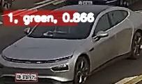
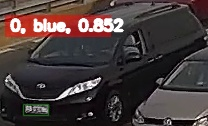

<!--
 * @Author: xujianrong xujianrong@sutpc.com
 * @Date: 2022-11-18 15:31:49
 * @LastEditTime: 2023-10-24 11:59:30
 * @LastEditors: xujianrong xujianrong@sutpc.com
 * @Description: 
 * @FilePath: /yolov5_vehicleLicenseColor/README.md
 * 
-->


# 训练
```
CUDA_VISIBLE_DEVICES=0,1 python train.py --img 640 --batch 64 --epochs 100 --data sucity-19-baoan.yaml --weights /workspace/models/yolov5/tensorrtx/yolov5s.pt --sync-bn  --device 0,1
```


# 测试
```
CUDA_VISIBLE_DEVICES=0,1 python test.py  --data sucity-vehicle-5-v1.1.yaml    --weights /workspace/py/ultralytics/yolov5_container/app/runs/train/exp11/weights/best.pt   --batch 128

```

# 推理
```
python detect.py --source results/val_trt_output_dir --weights yolov5s.pt --conf 0.25
```

# 结果


| 标签\输出 | 示例 |
| ---- | ---- |
|   绿牌   |      |
|||
|   蓝牌   |      |

# trt 相关

## 模型转化工程
```
git clone git@e.coding.net:sutpc/kczx.ai.sensor/yolov5_tensorrtx_vehicleLicenseColor.git

cd yolov5_tensorrtx_vehicleLicenseColor/build
sudo ./yolov5 -d yolov5s.engine ../samples
```
## trt 结果测试map

使用 yolov5_vehicleLicenseColor 项目，需要注意的是，batch size 只支持 **1**

```
cd yolov5_vehicleLicenseColor

python  test_trt.py --img-size 224 --data sutpc_vehicleLicenseColor2.1.yaml --weight /workspace/py/ultralytics/yolov5_vehicleLicenseColor/runs/train/exp16/weights/best.pt --batch-size 1 --device 1 


```

# 结果


| 标签\输出 | 示例                                      | 保留文件                                            |
| --------- | ----------------------------------------- | --------------------------------------------------- |
| 绿牌      |  | 1 22.035976 104.895805 31.452637 11.812248 0.921779 |
|           |                                           |                                                     |
| 蓝牌      |  | 0 47.100124 109.722656 29.102467 11.322311 0.671106 |
